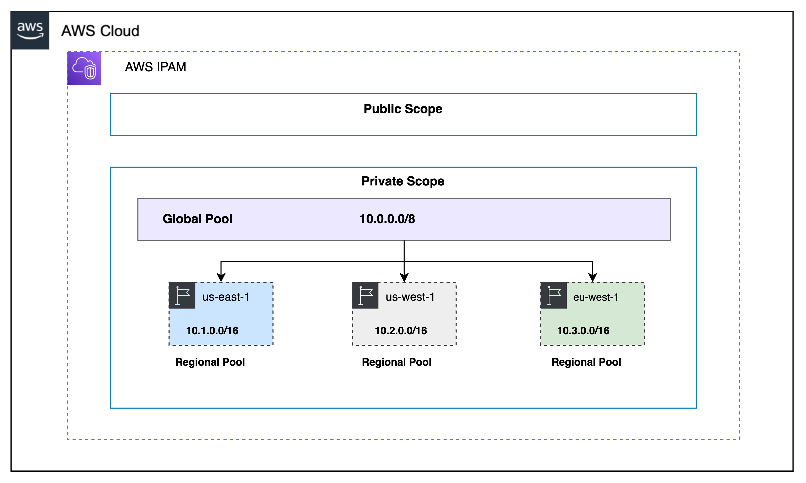

## AWS IPAM Terraform Module
This module will helps you to crete AWS IPAM to manage IP address in AWS account. Refering to the below architecture diagram you can create:
* One AWS IPAM
* One Public Scope
* One Private Scope
* One Global Pool
* Multiple Regional Pools

The regional pools are child of Global pool and inherit the defined CIDR from the top level.

Architecture


## Usage

```hcl
module "aws_ipam" {
  source            = "git::https://github.com/rajdeep617/terraform-aws-ipam-module.git"
  ipam_name         = var.ipam_name
  global_cidr       = var.global_cidr
  operating_regions = var.operating_regions
}

variable "ipam_name" {
  default = "global-ipam"
  type    = string
}

variable "global_cidr" {
  default = "10.0.0.0/8"
  type    = string
}

variable "operating_regions" {
  type = map(string)
  default = {
    "us-east-1" = "10.1.0.0/16"
    "us-west-1" = "10.2.0.0/16"
    "eu-west-1" = "10.3.0.0/16"
  }
}
```

## Examples
Refer to the [examples](https://github.com/rajdeep617/terraform-aws-ipam-module/tree/master/examples) directory in this GitHub repository for complete terraform code example. 

## Known issues

No known issues.

## Requirements

| Name | Version  |
|------|----------|
| <a name="requirement_terraform"></a> [terraform](#requirement\_terraform) | >= 1.0.0 |
| <a name="requirement_aws"></a> [aws](#requirement\_aws) | >= 3.29  |

## Providers

| Name | Version |
|------|---------|
| <a name="provider_aws"></a> [aws](#provider\_aws) | >= 4.0  |

## Modules

No modules.

## Resources
| Name                                                                                                         | Type |
|--------------------------------------------------------------------------------------------------------------|------|
| [aws_region.current](https://registry.terraform.io/providers/hashicorp/aws/latest/docs/data-sources/region)  | data source |
| [aws_vpc_ipam.default](https://registry.terraform.io/providers/hashicorp/aws/latest/docs/resources/vpc_ipam) | resource |
| [aws_vpc_ipam_pool.global](https://registry.terraform.io/providers/hashicorp/aws/latest/docs/resources/vpc_ipam_pool) | resource |
| [aws_vpc_ipam_pool_cidr.global](https://registry.terraform.io/providers/hashicorp/aws/latest/docs/resources/vpc_ipam_pool_cidr) | resource |
| [aws_vpc_ipam_pool.regional](https://registry.terraform.io/providers/hashicorp/aws/latest/docs/resources/vpc_ipam_pool) | resource |
| [aws_vpc_ipam_pool_cidr.regional](https://registry.terraform.io/providers/hashicorp/aws/latest/docs/resources/vpc_ipam_pool_cidr) | resource |

## Inputs
| Name                                                                                    | Description                                                       | Type          | Default | Required |
|-----------------------------------------------------------------------------------------|-------------------------------------------------------------------|---------------|---------|:--------:|
| <a name="input_ipam_name"></a> [ipam\_name](#input\_ipam\_name)                         | AWS IPAM Name                                                     | `string`      |         |   Yes    |
| <a name="input_operating_regions"></a> [operating\_regions](#input\_operating\_regions) | MAP of AWS regions and crossponding CIDR to create regional pools | `map(string)` |         |   Yes    |
| <a name="input_global_cidr"></a> [global\_cidr](#input\_global\_cidr)                   | Global CIDR                                                       | `string`      |         |   Yes    |
| <a name="input_default_netmask"></a> [default\_netmask](#input\_default\_netmask)       | Default netmask for pool allocation                               | `number`      | 16      |    No    |

## Outputs

| Name                                                                                     | Description             |
|------------------------------------------------------------------------------------------|-------------------------|
| <a name="output_ipam_id"></a> [ipam\_id](#output\_ipam\_id)                              | The ID of IPAM          |
| <a name="output_private_scope_id"></a> [private\_scope\_id](#output\_private\_scope\_id) | The ID of Private Scope |
| <a name="output_public_scope_id"></a> [public\_scope\_id](#output\_public\_scope\_id)    | The ID of Public Scope  |

## Authors
Module managed by [Rajdeep Hayer](https://github.com/rajdeep617).
